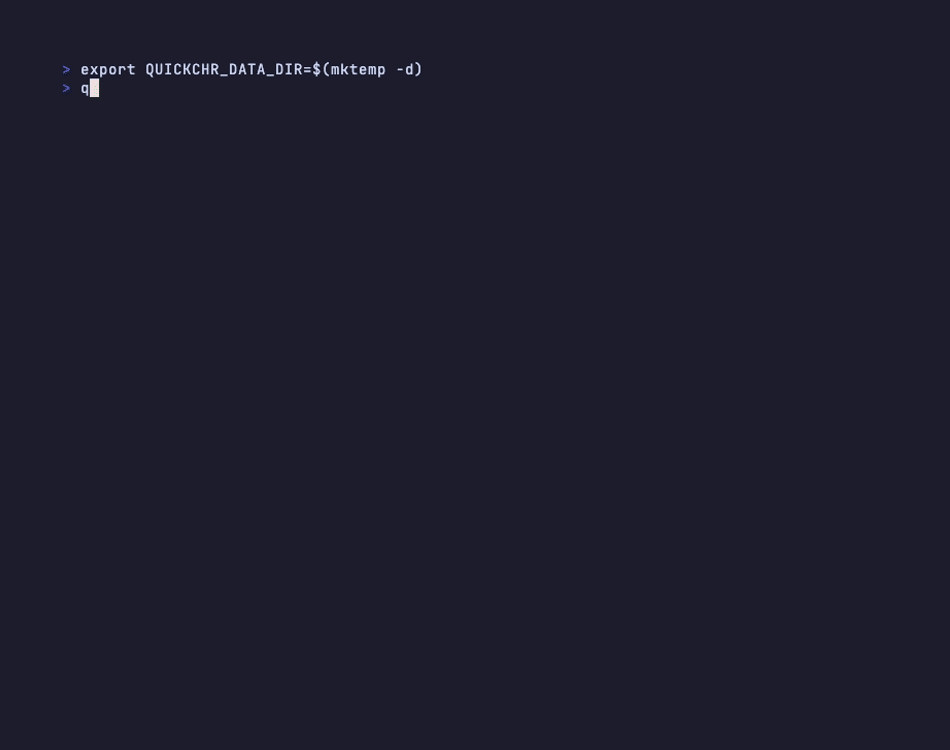

# quickchr

> **Experimental** — quickchr is under active development. Most testing has been on
> macOS (Apple Silicon + Intel), with CI on Linux (x86_64 + aarch64). Windows support
> is early-stage: unit tests pass on `windows-latest` CI, but integration tests
> (running a real CHR via QEMU for Windows) are not yet automated. Expect rough edges
> on Windows — bug reports welcome.

CLI and library to download, launch, and manage MikroTik CHR virtual machines via QEMU.

## Quick Start

### Prerequisites

- [Bun](https://bun.sh) runtime
- [QEMU](https://www.qemu.org) with `qemu-system-x86_64` and/or `qemu-system-aarch64`
- `qemu-img` for disk resize and extra-disk features (`--boot-size`, `--add-disk`, `quickchr disk`)
- UEFI firmware (edk2) for arm64 CHR

Install QEMU:

```bash
# macOS
brew install qemu

# Ubuntu/Debian
sudo apt install qemu-system-x86 qemu-system-arm qemu-efi-aarch64 qemu-utils

# Fedora/RHEL
sudo dnf install qemu-kvm qemu-system-aarch64 edk2-aarch64 qemu-img

# Arch
sudo pacman -S qemu-full
```

```powershell
# Windows — install QEMU (qemu-img is included)
winget install SoftwareFreedomConservancy.QEMU

# Install Bun (PowerShell — matches bun.sh official install docs)
powershell -c "irm bun.sh/install.ps1 | iex"
# Alternative: winget install Oven-sh.Bun
```

### Install

CLI:

```bash
bun install -g @tikoci/quickchr
quickchr doctor
```

Library:

```bash
bun add @tikoci/quickchr
```

### CLI Usage

The easiest way to start is the interactive wizard — it walks through
every option and starts the CHR for you:

```bash
quickchr setup
```



Or run `quickchr` with no arguments on a TTY to get the same wizard
automatically. See [MANUAL.md §3 setup](./MANUAL.md#setup) for a
step-by-step breakdown of every wizard prompt.

All wizard options are also available as flags for scripting:

```bash
# Create a machine without starting it
quickchr add --name my-chr --channel stable --arch arm64

# Create with a resized boot disk and extra blank disks
quickchr add --name lab --boot-size 1G --add-disk 512M --add-disk 2G

# Start an existing machine
quickchr start my-chr

# Create and start in one step
quickchr start --name throwaway --version 7.22.1 --boot-size 2G

# List instances (table view)
quickchr list

# Detailed status for one instance
quickchr status my-chr

# Stop an instance
quickchr stop my-chr

# Stop all instances
quickchr stop --all

# Run a RouterOS CLI command on a running instance
quickchr exec my-chr /system/resource/print
quickchr exec my-chr ":put [/system/routerboard/get serial-number]"

# Attach to serial console of a running instance (exit: Ctrl-A X)
quickchr console my-chr

# Tail QEMU log
quickchr logs my-chr
quickchr logs my-chr --follow

# Query live machine config (license, device-mode, admin users)
quickchr get my-chr
quickchr get my-chr license
quickchr get my-chr device-mode --json

# Manage snapshots (requires qcow2 boot disk)
quickchr snapshot my-chr list
quickchr snapshot my-chr save before-upgrade
quickchr snapshot my-chr load before-upgrade
quickchr snapshot my-chr delete before-upgrade

# Apply or renew a trial license
quickchr license my-chr

# Network discovery and virtual socket management
quickchr networks
quickchr networks sockets

# Set up shell completions (bash/zsh/fish)
quickchr completions

# Reset disk to fresh image
quickchr clean my-chr

# Inspect disk layout
quickchr disk lab

# Remove instance entirely
quickchr remove my-chr

# Check prerequisites
quickchr doctor
```

### Create / Start Options

| Flag | Description | Default |
|------|-------------|---------|
| `--version <ver>` | RouterOS version (e.g., 7.22.1) | Latest stable |
| `--channel <ch>` | stable, long-term, testing, development | stable |
| `--arch <arch>` | arm64, x86, or auto | Host native |
| `--name <name>` | Instance name | Auto-generated |
| `--cpu <n>` | vCPU count | 1 |
| `--mem <mb>` | Memory in MB | 512 |
| `--boot-disk-format <f>` | Boot disk format: qcow2\|raw | qcow2 |
| `--boot-size <size>` | Resize boot disk (e.g., 512M, 2G). Requires `qemu-img`. | |
| `--add-disk <size>` | Attach an extra blank qcow2 disk. Repeatable. Requires `qemu-img`. | |
| `--bg` / `--background` | Run in background (default) | true |
| `--fg` / `--foreground` | Run in foreground — serial console on stdio | |
| `--add-package <pkg>` | Extra package to install (repeatable) | |
| `--install-all-packages` | Install all packages from `all_packages.zip` | |
| `--add-user <user:pass>` | Create a user after boot | |
| `--disable-admin` | Disable the default admin account | |
| `--no-secure-login` | Keep admin with no password (skip managed account creation) | |
| `--add-network <spec>` | Add a network NIC (repeatable). Specs: `user`, `shared`, `bridged:<iface>`, `socket::<name>`, `tap:<iface>`. Default: single user NIC. | |
| `--no-network` | Start with no NICs (headless) | |
| `--no-winbox` | Exclude WinBox port mapping | |
| `--no-api-ssl` | Exclude API-SSL port mapping | |
| `--license-level <l>` | Apply trial license: p1, p10, unlimited | |
| `--license-account <a>` | MikroTik account email | env `MIKROTIK_WEB_ACCOUNT` |
| `--license-password <p>` | MikroTik account password | env `MIKROTIK_WEB_PASSWORD` |
| `--device-mode <m>` | Configure device-mode: rose\|advanced\|basic\|home\|auto\|skip | |
| `--device-mode-enable <f>` | Set one or more device-mode flags to yes | |
| `--device-mode-disable <f>` | Set one or more device-mode flags to no | |
| `--port-base <port>` | Starting port number | Auto (9100+) |
| `--timeout-extra <s>` | Add extra seconds to the auto-computed boot timeout | |
| `--dry-run` | Print what would run without executing | |

### RouterOS Provisioning Support Policy

quickchr separates **boot-only** machine management from **post-boot provisioning**.

- **Boot-only / QEMU-local features work on older RouterOS 7.x builds:** image download, boot/start, disk resize, extra disks, network attachment, and port mappings.
- **Post-boot provisioning is validated/tested on RouterOS 7.20.8+ only:** package install, managed login or custom user creation, disabling admin, CHR license operations, and device-mode changes.
- This is a **quickchr support policy**, not a RouterOS claim that older versions can never work. We intentionally stop at the first long-term baseline to avoid version-specific provisioning traps that are not covered by tests.
- If you plan to provision, prefer **`--channel long-term`** or an explicit version **`>= 7.20.8`**.

| Feature | Minimum RouterOS | Notes |
|---------|------------------|-------|
| Boot / start / stop | Any RouterOS 7.x | Boot-only path; no post-boot RouterOS mutations |
| Disk resize / extra disks / disk inspection | Any RouterOS 7.x | Requires host `qemu-img`; QEMU-local only |
| Network attachment / port mappings | Any RouterOS 7.x | QEMU networking setup; not provisioning |
| Managed login / custom user / disable-admin | 7.20.8+ | Post-boot provisioning |
| Package install / install-all-packages | 7.20.8+ | Post-boot provisioning |
| License apply / renew | 7.20.8+ | Post-boot provisioning |
| Device-mode changes | 7.20.8+ | Post-boot provisioning; intentionally unsupported below the baseline |

### Background vs Foreground Mode

By default `quickchr start` runs QEMU in the **background**: QEMU is spawned as a detached process and the command returns once CHR has booted. Use `quickchr list`, `quickchr status`, and `quickchr stop` to manage it.

```bash
# Background (default) — returns after CHR finishes booting
quickchr start --channel stable

# Foreground — serial console attached to your terminal
quickchr start --channel stable --fg
```

In **foreground** mode, your terminal becomes the CHR serial console. Use these key sequences:

| Key | Action |
|-----|--------|
| `Ctrl-A X` | Exit QEMU and return to shell |
| `Ctrl-A C` | Toggle QEMU monitor (`quit` to force-stop) |
| `Ctrl-A H` | List all key shortcuts |

> **Note:** Background QEMU processes are true OS-level orphans — `quickchr` does not use shell job control (`&`). After the command returns you can close the terminal and QEMU keeps running. Use `quickchr stop <name>` to shut it down cleanly.

### Disk Support

- The CHR boot image starts as raw. Using `--boot-size` converts it to qcow2 and resizes it before first boot.
- Extra disks from `--add-disk` are always created as blank qcow2 images.
- `quickchr clean <name>` removes any resized boot disk and extra disks, then recreates them from the saved machine config.
- `quickchr disk <name>` shows the stored disk layout. If `qemu-img` is installed, it also shows virtual and actual sizes.
- `quickchr snapshot` manages qcow2 internal snapshots (requires a qcow2 boot disk).

### Multi-NIC Networking

By default each CHR gets a single user-mode NIC (SLIRP). Use `--add-network` to add more NICs or replace the default:

```bash
# Two CHRs on a shared L2 segment via socket_vmnet (macOS) or bridge (Linux)
quickchr start --name router1 --add-network user --add-network shared
quickchr start --name router2 --add-network user --add-network shared

# Named virtual socket (L2 tunnel between CHRs)
quickchr networks sockets create lab-switch
quickchr start --name r1 --add-network socket::lab-switch
quickchr start --name r2 --add-network socket::lab-switch

# Bridge to a physical interface
quickchr start --name gw --add-network user --add-network bridged:en0
```

### Port Layout

Each instance gets a block of 10 ports. With the default base of 9100, the first instance maps:

| Offset | Service | Default port |
|--------|---------|-------------|
| +0 | HTTP / REST / WebFig | 9100 |
| +1 | HTTPS | 9101 |
| +2 | SSH | 9102 |
| +3 | RouterOS API | 9103 |
| +4 | RouterOS API-SSL | 9104 |
| +5 | WinBox | 9105 |
| +6–+9 | Reserved (spare) | 9106–9109 |

The second instance gets 9110–9119, and so on.

### Library Usage

```typescript
import { QuickCHR } from "@tikoci/quickchr";

// Start a CHR instance
const chr = await QuickCHR.start({
  name: "disk-lab",
  channel: "stable",
  arch: "arm64",
  mem: 512,
  bootSize: "1G",
  extraDisks: ["512M", "2G"],
});

// Use REST API
const info = await chr.rest("/system/resource");
console.log(info);

// Run a RouterOS CLI command
const result = await chr.exec("/system/resource/print");
console.log(result);

// Stop (or remove)
await chr.stop();
await chr.remove();

console.log(chr.state.bootDiskFormat); // "qcow2"
console.log(chr.state.extraDisks);     // ["512M", "2G"]
```

### Use in Tests

```typescript
import { describe, test, afterAll, expect } from "bun:test";
import { QuickCHR } from "@tikoci/quickchr";

let chr: Awaited<ReturnType<typeof QuickCHR.start>>;

test("boot CHR and check version", async () => {
  chr = await QuickCHR.start({ channel: "stable" });

  const resource = await chr.rest("/system/resource");
  expect(resource["board-name"]).toBe("CHR");
}, 120_000);

afterAll(async () => {
  if (chr) await chr.remove();
});
```

## Environment Variables

| Variable | Description |
|----------|-------------|
| `MIKROTIK_WEB_ACCOUNT` | MikroTik.com account email (for license renewal) |
| `MIKROTIK_WEB_PASSWORD` | MikroTik.com password (for license renewal) |
| `QUICKCHR_INTEGRATION` | Set to `1` to run integration tests |

## Documentation

- **[MANUAL.md](./MANUAL.md)** — complete reference: every CLI command,
  every library API, provisioning, channels, networking, storage,
  errors. Source-checked.
- **[DESIGN.md](./DESIGN.md)** — architecture, layers, design principles.
- **[CONTRIBUTING.md](./CONTRIBUTING.md)** — dev setup and `bun run check`.
- **[CHANGELOG.md](./CHANGELOG.md)** — release history.

## License

MIT
