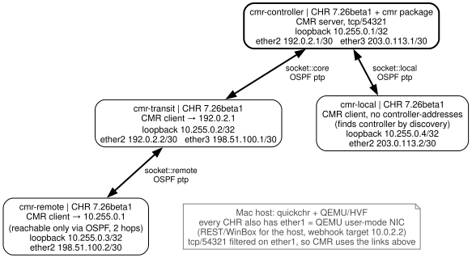

# CMR on RouterOS 7.26beta1: findings for MikroTik

**Status:** beta field notes, work in progress. These are early observations
from one release (7.26beta1) on x86 CHR. They are not a verdict on CMR, and a
later beta may change any of them.

Everything here was reproduced on disposable CHRs built by this example
(see [README.md](./README.md)). No physical router was used and no upgrade was
run. Each finding was reproduced at least twice: once by the run that found it,
and again on a fresh lab on 2026-10-06 (UTC). Raw evidence is in
[REPORT.md](./REPORT.md) and [config/](./config/).



Four CHRs, all 7.26beta1 x86. Only the controller has the `cmr` package; the
clients use the built-in `/cmr/client`. The remote client can reach the
controller's loopback only through OSPF via the transit router. The local client
has no `controller-addresses` and finds the controller by discovery. Every CHR
also has a QEMU user-mode NIC (`ether1`) for host management. tcp/54321 is
filtered on that NIC, so CMR traffic uses the socket links.

## What worked

Most of what we tried worked first time:

- Controller package on one router, built-in client everywhere else. The dynamic
  `cmr` service listens on tcp/54321.
- A routed client pairing to a loopback two OSPF hops away, and a directly
  attached client finding the controller with no address configured.
- All six combinations of client `none`/`password` and per-device controller
  `none`/`password`/`confirm` paired from a fresh state.
- Labels and auto-labels, `/cmr/device/run-script` across all four routers with
  per-device output, and a topology layout with four nodes and three links that
  match the cabling.
- Alerts for a log regex, a bridge being added (with the exception in finding 3),
  `disconnected-more-than`, `connected` and `rebooted`. HTTP webhooks were POSTed
  to a listener on the host with substituted fields, and `action-failures` stayed
  at 0.
- A pinned upgrade rule is selected by labelled devices (no upgrade was run).
- Binary backup: `/system/backup/save`, then `/cmr set enabled=no`, then
  `/system/backup/load` brought back the controller settings, device identities,
  labels and pairing IDs.
- Clients reconnected with their pairing intact after a clean `/system/reboot`,
  after a hard power-off of the client VM, and after a controller reboot.

## 1. Export omits the controller settings

`/cmr/export`, `/cmr/export verbose` and `/export verbose` (and
`/export show-sensitive`) include `/cmr alert`, `/cmr layout` and `/cmr upgrade`
rules, but not the server settings. On a controller with:

```routeros
/file/add type=directory name=cmr-packages
/cmr/set enabled=yes packages-directory=cmr-packages/ track-topology=yes \
  fetch-comments=yes auto-labels=all
```

`/cmr/print` shows those values, but no export contains a `/cmr set` line.
Apart from the rules, the verbose export has only a `/cmr client` stanza, with
the comment `# settings ignored because used by local controller`.

Labels assigned with `/cmr/device/set labels=…` are also not exported. That may
be intended, because device rows carry pairing state.

**Expected:** an export that recreates an enabled controller with its package
directory and topology options. A binary backup does restore them.

## 2. Client `pairing-requirement=confirm` is documented but not accepted

The [CMR manual](https://manual.mikrotik.com/docs/management-tools/cmr/) lists
`none`, `password` and `confirm` for the client's `pairing-requirement`.
`confirm` means local approval with `/cmr/client/pair`. On a 7.26beta1 client:

```routeros
/cmr/client/set pairing-requirement=confirm
# syntax error (line 1 column 37)
```

`/console/inspect` completion offers only `none` and `password`, and
`:parse` rejects the line too. On the controller, completion offers all three
values both globally (`/cmr/set`) and per device (`/cmr/device/set`), and
per-device `confirm` works (it is one of the six pairings above).

**Expected:** either client `confirm` as documented, or a manual note that it is
not in this beta. There is a `/cmr/client/push-button` command, which we did
not test.

## 3. The first bridge added to a device does not fire `interface-change=added`

A rule like this on the controller:

```routeros
/cmr/alert/add name=br-add labels=remote interface-type=bridge \
  interface-change=added action.log="IFACE [identity] [iface-name]"
```

Then, on a paired client that has **no bridges yet**:

```routeros
/interface/bridge/add name=first-probe     # rule stays at fired=0 (watched 90 s)
/interface/bridge/add name=second-probe    # fired=1 within ~10 s, log names second-probe
```

What we checked:

- The client had been paired and monitored for about two minutes first, so a
  startup window is unlikely. A log-regex alert on the same client fired normally.
- The same happened on three different clients: remote with the rule above,
  and transit and local with an untyped rule (`interface-change=added`, no
  `interface-type`). Each missed the first bridge and caught the second.
- It is per device, not per rule. A rule created *after* a device already had a
  bridge fired on its first match.
- When the client already has a bridge before CMR starts, a later addition
  alerts. The example's default lab does this.

**Expected:** the first bridge on a device alerts like the rest. We have not
looked into the cause; it might be that a device with no interfaces of that type
has no starting list to compare against.

## 4. Question: client disable/enable clears its pairing, but a reboot does not

On a paired, connected client:

```routeros
/cmr/client/set enabled=no
/cmr/client/set enabled=yes
```

The client reconnects but comes back as `waiting-for-pairing,connected` with
`pairing-status=password required/ok…`. The controller keeps the device row
(identity and labels) and flags it `p` (REMOTE-PENDING). It stayed that way for
the 45 s we watched, and pairing again with credentials restored it. A clean
`/system/reboot` or a hard power-off of the same client keeps the pairing.
Reproduced on two clients, both left at the default `pairing-requirement`
(which asks the controller for a password).

The manual says disabling the client removes the CMR-managed (`Y`)
configuration, but it does not mention pairing. If clearing the pairing is
intended, a sentence in the manual would help. It is easy to do by accident
while troubleshooting.

## Checked and withdrawn: "routed client does not reconnect after restart"

An earlier run reported that the routed client stayed `paired,disconnected`
for 90+ seconds after a restart, while OSPF was Full and pings to the controller
worked. That was caused by our lab, not by CMR:

- While OSPF had no route to `10.255.0.1`, the client's TCP connect followed the
  DHCP default route out of `ether1`, using that NIC's address `10.0.2.15` as
  its source.
- OSPF came back seconds later, but connection tracking showed the same socket
  (same source port) still retrying its SYN from `10.0.2.15`, with growing
  gaps. Every QEMU user-mode NIC is `10.0.2.15`, so no reply could ever arrive.
- Only after that socket gave up did a new attempt, from `198.51.100.2`,
  connect. That was about 85 s after the route had come back.

We reproduced this by rebooting the controller, which withdraws the OSPF route.
The earlier failures were client restarts; we infer they were the same race at
boot, with the client dialling before OSPF had installed the route. Our own
unfixed restarts reconnected about 6 s after REST came up, so the race does not
happen every time.

Adding `chain=output out-interface=ether1 dst-port=54321 action=reject
reject-with=tcp-reset` cut the reconnect after a controller reboot from about
95 s to about 22 s. The counter showed exactly one rejected packet. The example
now includes that rule, and with it the full `--probe` run (stop the remote,
start it, require reconnect without re-pairing) passes.

What this means for real networks: if a client's route to the controller can be
withdrawn while a default route exists, the reconnect attempt may leave with the
wrong source address. If replies to that address cannot get back, the reconnect
waits out one TCP SYN timeout (about 90 s here) after the route comes back.

## Small notes (not bugs)

- The default `packages-directory` is `cmrpkgs`, but no such directory exists on
  a fresh install. A new value must be an existing directory and end in `/`
  (`cmr-packages` is rejected, `cmr-packages/` is accepted). Once changed, the
  default cannot be set back unless a `cmrpkgs` directory is created first.
- The default upgrade rule (`channel=stable`, cannot be edited) shows 7.24.5 as
  `available-version`, with the `U` flag, on 7.26beta1 devices. That is a
  downgrade. The manual explains the default rule, but a "U" for a downgrade is
  easy to misread.

## Not tested

WiFi provisioning and radio alerts (CHR has no radios), VLAN provisioning,
application traffic, DHCP-option discovery, push-button pairing, wrong-password
handling, real upgrades, ARM CHR, and anything after 7.26beta1.
